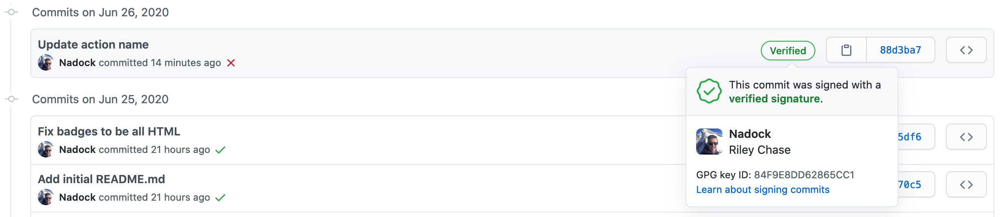

<!-- markdownlint-disable MD033 -->
# Verified Commits Check

<!-- HTML here because we want centre alignment -->
<p align="center">
    <a href="https://github.com/Nadock/verified_commits_check/actions/workflows/pr_checks.yml">
        
    </a>
    <a href="https://github.com/Nadock/verified_commits_check/actions/workflows/example.yml">
        
    </a>
    <a href="https://github.com/psf/black">
        
    </a>
    <a href="https://github.com/Nadock/verified_commits_check/releases">
      
    </a>
</p>

A GitHub Action to check commits pushed to a repository to ensure they are verified (aka signed).

## Archive notice

**I've archived this repo because I no longer intend on maintaining the code, but it should still work fine if you want to use it.**

## Setup

Copy the text below into a file in your repository called `.github/workflows/verified_commits_check.yml`, then just commit and push it!

```yaml
# .github/workflows/verified_commits_check.yml
name: Run verified commits check

on: push

jobs:
  verified_commit_check:
    name: Check for unverified commits
    runs-on: ubuntu-latest
    steps:
      - uses: nadock/verified_commits_check@v1
```

**:warning: Note:** Currently this action only supports `push` event types. Using `pull_request` or any other will cause the
action to fail.

You can see this example in action in this repository [here](https://github.com/nadock/verified_commits_check/actions?query=workflow%3A%22An+example+workflow%22).

### Message destinations

`verified_commits_check` can send the notification messages for unverified commits to one of a few places. By default, if you do not specify `MESSAGE_BACKEND`, it will be printed to the GitHub Actions build log. If you would prefer to have the messages sent to one of the other supported backend, follow the additional setup instructions for that backend below.

#### Slack webhook

To have `verified_commits_check` send notification messages to a Slack Webhook, follow the steps below.

1. Setup a Slack Webhook to receive the notification message by following [Slack's guide here](https://slack.com/help/articles/115005265063-Incoming-Webhooks-for-Slack).
2. Add the Webhook URL setup in the previous step to your repositories secrets by following [GitHub's guide here](https://docs.github.com/actions/configuring-and-managing-workflows/creating-and-storing-encrypted-secrets#creating-encrypted-secrets-for-a-repository).
3. Update your workflow file tin in include the `MESSAGE_BACKEND` and `SLACK_WEBHOOK_URL` environment variables like the example below.

```yaml
name: Run verified commits check

on: push

jobs:
  verified_commit_check:
    name: Check for unverified commits
    runs-on: ubuntu-latest
    env:
      MESSAGE_BACKEND: slack
      # Assuming you named the secret from step 2 "slack_webhook_url"
      SLACK_WEBHOOK_URL: ${{ secrets.slack_webhook_url }}
    steps:
      - uses: nadock/verified_commits_check@v1
```

<sup><b><i>Note: Anyone who has your Slack Webhook URL can send you messages, so store it securely!</i></b></sup>

## Common questions

**What are verified commits?**

Verified commits are commits that have been GPG signed by their author, ensuring they truly do come from a trusted source. GitHub has more details in their documentation [here](https://help.github.com/en/github/authenticating-to-github/managing-commit-signature-verification), including how to setup commit signing if you haven't already.

When you commits are verified, you should see the "Verified" badge on your commits like this:



**Why not just use the branch protection rule?**

GitHub provides a branch protection rule to prevent unverified commits from being merged into protected branches. However, you usually get little or no warning you've mistakenly pushed unsigned commits until you try to merge your PR. This action will warn you whenever you push unverified commits, allowing you to notice and fix the issue sooner.

**I wish it sent messages to X...**

Okay technically not a question, but if you want to add support for sending a message to some other service when unverified commits are detected (other than the default failed action email) I welcome pull requests to add support. Please check the [`CONTRIBUTING.md`](https://github.com/Nadock/verified_commits_check/blob/master/CONTRIBUTING.md) file for more details.
